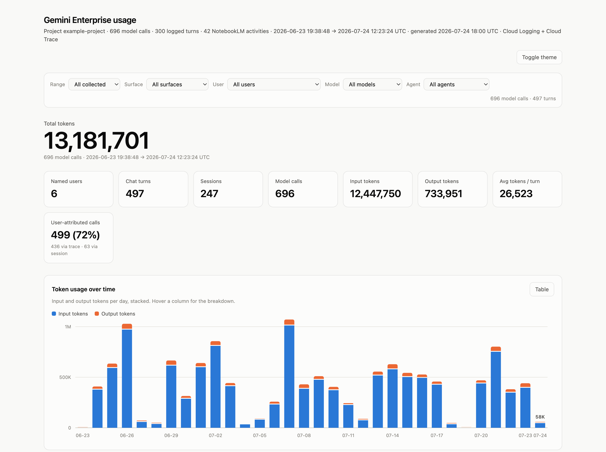
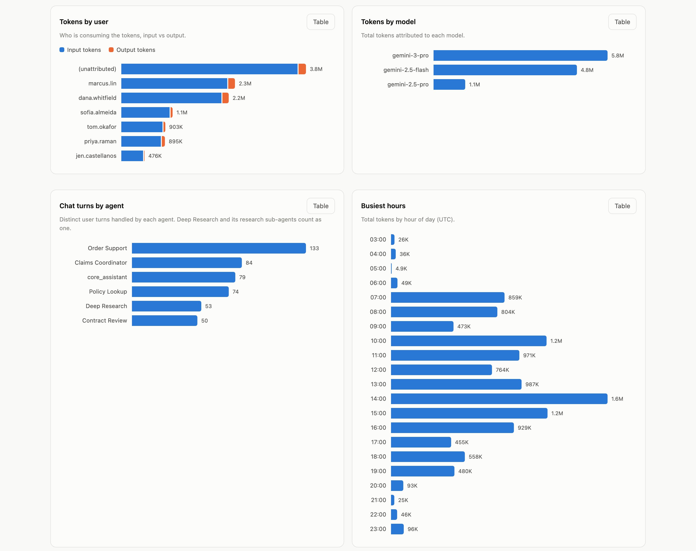
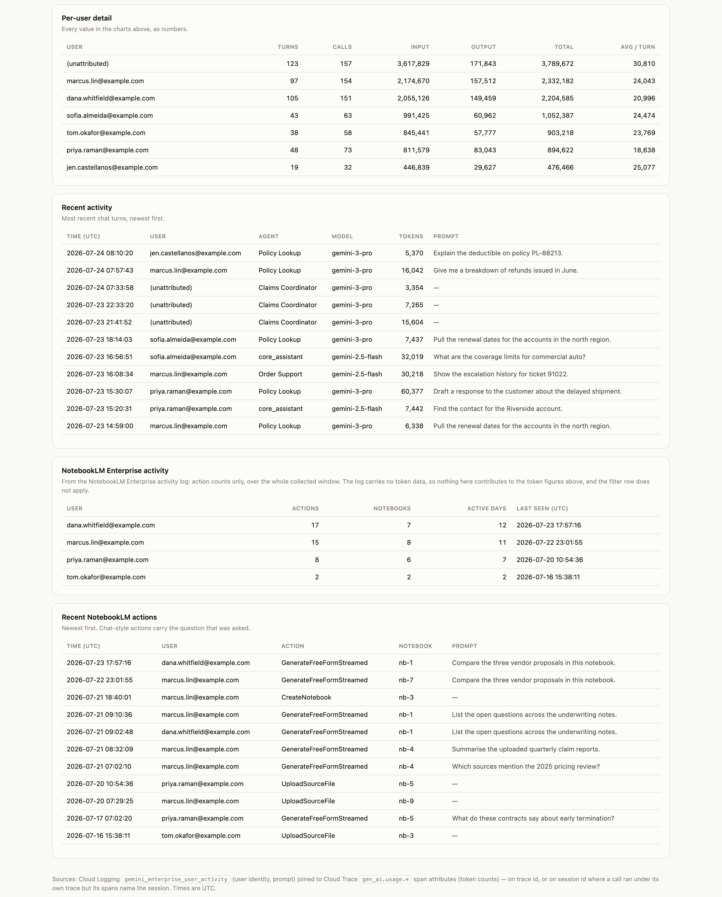
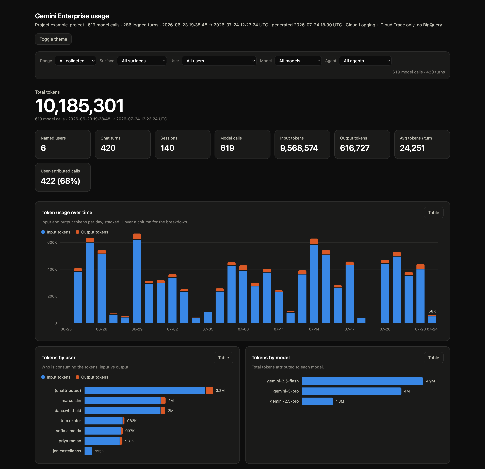

# Gemini Enterprise Usage Analytics

Export Gemini Enterprise token and activity telemetry **out of Google Cloud** into
a local SQLite database, and read it internally, either as SQL or as a self-contained
HTML dashboard that opens with no network access.



---

## Contents

1. [What this is for](#1-what-this-is-for)
2. [Why two data sources are required](#2-why-two-data-sources-are-required)
3. [Requirements](#3-requirements)
4. [Installation](#4-installation)
5. [Try it without a Google Cloud project](#5-try-it-without-a-google-cloud-project)
6. [First run](#6-first-run)
7. [Command reference](#7-command-reference)
8. [The dashboard](#8-the-dashboard)
9. [Querying the data](#9-querying-the-data)
10. [Scheduling regular collection](#10-scheduling-regular-collection)
11. [Attribution coverage](#11-attribution-coverage)
12. [NotebookLM Enterprise](#12-notebooklm-enterprise)
13. [Data model](#13-data-model)
14. [Limits](#14-limits)
15. [Extending it](#15-extending-it)
16. [Security and data handling](#16-security-and-data-handling)
17. [Troubleshooting](#17-troubleshooting)
18. [How it works internally](#18-how-it-works-internally)
19. [Development](#19-development)

---

## 1. What this is for

The usual way to report on Gemini Enterprise usage is to route logs into BigQuery
and query them there or through Observability Analytics.

This repository is for the case where you **cannot, or would rather not**, and
the telemetry has to come *out* of Google Cloud and be read somewhere you control.

**What it is not.** Not a real-time monitor, not a billing system of record, and
not a multi-user service. It is a read-only exporter and a local reporting layer.
See [Limits](#14-limits) for where it stops, and [Extending it](#15-extending-it)
for what to do at that point.

---

## 2. Why two data sources are required

Gemini Enterprise splits its telemetry across two Google Cloud services, and
neither is sufficient on its own.

| Field | Where it is recorded | Service |
|---|---|---|
| User account (`userIamPrincipal`) | `gemini_enterprise_user_activity` log | Cloud Logging |
| Prompt text, agent, session, engine | Same log entry | Cloud Logging |
| **Input and output token counts** | `gen_ai.usage.*` span attributes | **Cloud Trace** |
| Model name | `gen_ai.request.model` span attribute | Cloud Trace |
| Tool invocations and latency | `gen_ai.tool.name`, span timings | Cloud Trace |
| NotebookLM Enterprise actions | `notebooklm_enterprise_user_activity` log (opt-in) | Cloud Logging |

Token counts do not appear in the user-activity log. A log-only approach cannot
report consumption regardless of how the logs are queried, which is the single
most common reason a first attempt at this produces activity counts and no tokens.
(August 2026 release notes describe an experimental `gen_ai.*` log family for
Gemini Enterprise agents that carries usage attributes; it was absent from the
projects this tool was built against, so Cloud Trace remains the dependable
source.)

Both services stamp the same W3C trace id on their records. Joining on that id
reconstructs the full picture: *account → prompt → model → tokens*. This tool
performs that join locally — on the trace id, and on the session id where a call
ran under its own trace (see [Attribution coverage](#11-attribution-coverage)).

NotebookLM is the exception to all of the above: its log is separate, disabled by
default, and records activity without any token counterpart in Cloud Trace. See
[NotebookLM Enterprise](#12-notebooklm-enterprise).

---

## 3. Requirements

| Requirement | Detail |
|---|---|
| Python | 3.9 or later. Standard library only, nothing to install. |
| Google Cloud CLI | `gcloud`, authenticated. Used to obtain access tokens. |
| APIs enabled | Cloud Logging API, Cloud Trace API. |
| IAM roles | `roles/logging.viewer` and `roles/cloudtrace.user`. Both read-only. |

The tool never writes to Google Cloud. It issues read requests only, and the two
roles above grant no mutating permissions.

### Confirming prerequisites

```bash
python3 --version                 # expect 3.9+
gcloud --version
gcloud auth list                  # confirm an active account
gcloud config get-value project   # confirm the target project
```

If no account is active:

```bash
gcloud auth login
gcloud config set project YOUR_PROJECT_ID
```

---

## 4. Installation

Copy this directory to the machine that will run reports, then make the entry
point executable:

```bash
cd ge-usage-analytics
chmod +x ge_usage.py
python3 ge_usage.py --help
```

There is no build step, virtual environment or dependency installation. That is
deliberate: the host allowed to hold this data is often the one least able to
install packages.

---

## 5. Try it without a Google Cloud project

To see the dashboard before arranging any access:

```bash
make demo
```

This invents a month of plausible activity, renders it and opens the result. The
generator is deterministic and touches nothing outside the working directory.

```bash
python3 tools/make_demo_db.py --out demo.db --turns 420 --days 30
python3 ge_usage.py --db demo.db dashboard --project demo --open
```

---

## 6. First run

Collect the last 30 days into a local database:

```bash
python3 ge_usage.py collect --project YOUR_PROJECT_ID --days 30
```

```
project : YOUR_PROJECT_ID
window  : 2026-06-24 18:06 → 2026-07-24 18:06 UTC
database: /path/to/ge-usage-analytics/usage.db

[1/3] Cloud Logging: chat turns and user identity …
      309 turns · 5 distinct users

[2/3] Cloud Trace: model spans and token counts …
      620 model calls · 379 tool calls
      3,231,449 input tokens · 369,803 output tokens

[3/3] Cloud Logging: NotebookLM Enterprise activity …
      0 activities. NotebookLM Enterprise logging is off by default and has
      to be enabled per project; see 'NotebookLM Enterprise' in the README.

by surface:
  Gemini Enterprise       223 calls     121 user-attributed     2,079,056 tokens
  Agent Engine            397 calls       0 user-attributed     1,522,196 tokens

attributed to a user: 121/620 model calls (19.5%)
  121 via trace id · 0 via session id
```

Then:

```bash
python3 ge_usage.py stats             # per-user summary in the terminal
python3 ge_usage.py dashboard --open  # write dashboard.html and open it
```

> Collection is **additive and idempotent**. Re-running it over the same window
> updates existing rows rather than duplicating them, so overlapping runs are safe.

If the attribution percentage looks low, that is expected and explained in
[Attribution coverage](#11-attribution-coverage). Total token figures are complete
either way.

---

## 7. Command reference

All commands accept `--db PATH` to use a database other than the default
`usage.db`.

### `collect`

Reads from Google Cloud into the local database.

```bash
python3 ge_usage.py collect --project YOUR_PROJECT_ID --days 30
```

| Option | Purpose |
|---|---|
| `--project ID` | Target project. Falls back to `GE_PROJECT_ID`, `PROJECT_ID`, `GOOGLE_CLOUD_PROJECT`, then the active gcloud project. |
| `--days N` | Look back N days. Default 7. |
| `--since ISO` | Explicit start time, e.g. `2026-07-01T00:00:00Z`. Overrides `--days`. |
| `--engine-id ID` | Restrict to a single Gemini Enterprise application. |
| `--trace-filter F` | Cloud Trace filter; repeatable. Defaults to `span:generate_content` and `span:call_llm`. |

### `stats`

Prints a per-user summary table to the terminal, followed by a NotebookLM
activity table when that data exists.

### `query`

Runs SQL against the local database.

```bash
python3 ge_usage.py query "SELECT user_principal, SUM(total_tokens) FROM usage GROUP BY 1"
python3 ge_usage.py query "SELECT * FROM usage_by_user" --format csv > report.csv
```

`--format` accepts `table` (default), `json` or `csv`.

### `sql`

Opens an interactive `sqlite3` shell against the database.

### `dashboard`

Writes a self-contained HTML file.

| Option | Purpose |
|---|---|
| `--out PATH` | Output file. Default `dashboard.html`. |
| `--open` | Open in the default browser when finished. |
| `--theme dark` | Render with the dark palette. A toggle is also built into the page. |
| `--redact-queries` | Omit prompt text from the output. |

### `serve`

Renders the dashboard and serves it on `127.0.0.1:8777`, for hosts where opening a
local `file://` URL is blocked.

```bash
python3 ge_usage.py serve --port 8777 --open
```

---

## 8. The dashboard

`dashboard.html` is a single file with **no external references**. Data is
embedded as JSON, charts are inline SVG, styling is one `<style>` element. No CDN,
no build step and no network access are needed to view it. CI asserts this on every
push, because it is the property the whole format depends on.

A single filter row (range, surface, user, model, agent) scopes every chart at
once. The agent dimension folds Deep Research and its research sub-agents into
one entry, so selecting **Deep Research** and reading the tokens-by-user chart
answers "who uses it most" directly. Each chart has a **Table** button that
shows the same figures as numbers, for anyone who needs to copy them out.



Underneath the charts, the per-user detail table carries every value in the charts
as numbers, and the recent-activity table lists the most recent turns with their
prompts.



Light and dark palettes are stepped independently, so both hold up on their own
chart surfaces.



To regenerate these images after a change:

```bash
pip install '.[docs]'          # Pillow; also requires Google Chrome
python3 tools/make_demo_db.py --out demo.db
python3 tools/capture_screenshots.py --db demo.db
```

---

## 9. Querying the data

The `usage` view is the primary interface. Each row is one model call, with the
user, prompt and agent attached where available.

```sql
-- Token consumption by user
SELECT user_principal,
       SUM(input_tokens)  AS input_tokens,
       SUM(output_tokens) AS output_tokens,
       SUM(total_tokens)  AS total_tokens
FROM usage
WHERE attributed = 1
GROUP BY 1
ORDER BY total_tokens DESC;
```

```sql
-- Daily trend for one account
SELECT day,
       SUM(total_tokens)        AS tokens,
       COUNT(DISTINCT trace_id) AS turns
FROM usage
WHERE user_principal = 'user@example.com'
GROUP BY 1
ORDER BY 1;
```

```sql
-- Most expensive individual turns
SELECT trace_id,
       user_principal,
       SUM(total_tokens) AS tokens,
       MIN(query_text)   AS prompt
FROM usage
GROUP BY 1, 2
ORDER BY tokens DESC
LIMIT 10;
```

```sql
-- Model mix, split by surface
SELECT surface, model, COUNT(*) AS calls, SUM(total_tokens) AS tokens
FROM usage
GROUP BY 1, 2
ORDER BY tokens DESC;
```

```sql
-- Tool performance
SELECT tool_name,
       COUNT(*)                     AS invocations,
       CAST(AVG(latency_ms) AS INT) AS avg_ms
FROM tool_calls
GROUP BY 1
ORDER BY avg_ms DESC;
```

Because the store is ordinary SQLite, any SQLite-compatible client works too: DB
Browser for SQLite, Excel via ODBC, pandas, Metabase, or a Looker Studio extract.

---

## 10. Scheduling regular collection

Cloud Trace and the `_Default` log bucket both retain data for **30 days**. Older
records are unavailable from the APIs at any price.

Because collection is additive, running it on a schedule builds a local history
that extends past that window.

**Linux / macOS (cron)**, daily at 06:17, with a two-day overlap so a missed run
does not leave a hole:

```cron
17 6 * * * cd /path/to/ge-usage-analytics && /usr/bin/python3 ge_usage.py collect --project YOUR_PROJECT_ID --days 2 >> collect.log 2>&1
```

**Windows (Task Scheduler)**

```
Program:   python
Arguments: ge_usage.py collect --project YOUR_PROJECT_ID --days 2
Start in:  C:\path\to\ge-usage-analytics
```

Scheduled runs need valid credentials. On an unattended host, authenticate a
service account holding the two read-only roles:

```bash
gcloud auth activate-service-account --key-file=/path/to/key.json
```

---

## 11. Attribution coverage

Not every model call can be linked to a named user. This is worth understanding
before the figures are circulated, because it decides how they should be read:
**total token figures are complete; the per-user split is a floor.**

A model call is attributed through one of two keys, both exact identifiers
found on the data itself. The `usage` view records which one matched in
`attributed_via`.

**Via trace id.** Turns handled by the Gemini Enterprise core assistant emit
their `generate_content` spans inside the same trace as the `StreamAssist`
request, so the span joins straight to the log entry that names the account.

**Via session id.** A call that ran under its own trace still resolves when
its spans carry the Gemini Enterprise session in `gen_ai.conversation.id`: a
session belongs to exactly one signed-in account, so the tool takes the
session's latest turn at or before the span (falling back to its first later
one, since a long-running turn can be logged after its work begins). This is
the key an agent team controls — stamp the session, or propagate
`traceparent`, and attribution follows with no change to this tool. See
[Extending it](#15-extending-it).

**Unattributed.** Everything that carries neither key. A custom agent — ADK
on Agent Engine, or A2A on Cloud Run — executes under its own trace, Gemini
Enterprise does not propagate trace context into it, and the conversation id
its spans carry by default is the agent's own Agent Engine session, not the
Gemini Enterprise one. The tokens are captured accurately and arrive with no
user attached. Both joins are exact keys; the tool never assigns a user by
time proximity, so `(unattributed)` means exactly that.

### Deep Research

Deep Research is why per-agent coverage matters more than the single
percentage. Observed on a live project (August 2026): the request is one
logged StreamAssist turn; the planner and a minority of sub-agent calls
execute inside that turn's trace and resolve through it; the remaining
sub-agents run detached, and their spans carry **no session id either** — so
no exact key exists today, and they stay unattributed under their own
`deep_research_child_N` agent names. Their tokens are fully counted; the
per-user split simply cannot include them yet. If a platform update stamps
either key on those spans, they start resolving with no change to this tool.

Per-agent coverage is one query:

```sql
SELECT agent, surface, model_calls, via_trace, via_session,
       model_calls - attributed_calls AS unattributed, total_tokens
FROM usage_by_agent
ORDER BY total_tokens DESC;
```

| Agent | Surface | Calls | Via trace | Via session | Unattributed | Tokens |
|---|---|---|---|---|---|---|
| Claims Coordinator | Agent Engine | 118 | 0 | 0 | 118 | 1,648,256 |
| core_assistant | Gemini Enterprise | 114 | 114 | 0 | 0 | 1,643,475 |
| Contract Review | Agent Engine | 78 | 0 | 78 | 0 | 1,057,286 |
| deep_research_child_2 | Gemini Enterprise | 14 | 3 | 0 | 11 | 618,508 |
| deep_research | Gemini Enterprise | 14 | 14 | 0 | 0 | 94,715 |

*From the synthetic demo data, shaped like a live collection: Claims
Coordinator stamps nothing and stays dark, Contract Review stamps the Gemini
Enterprise session and resolves fully, and Deep Research resolves only where
its calls landed inside the request trace.*

That per-child grain is for diagnosing coverage. For ranking people, the
`agent_group` column folds the whole family into one entity — it is also what
the dashboard's agent dimension uses:

```sql
-- Who uses Deep Research the most (the attributed floor)
SELECT user_principal, COUNT(*) AS calls, SUM(total_tokens) AS tokens
FROM usage
WHERE agent_group = 'Deep Research'
GROUP BY 1
ORDER BY tokens DESC;
```

The residual gap is a characteristic of the platform's telemetry, not of the
collection method. The same split appears in any pipeline built on these
sources, **including a BigQuery-based one**. Closing it requires the spans to
carry a key — trace context propagated into the agent, or the session stamped
on its spans; see [Extending it](#15-extending-it).

---

## 12. NotebookLM Enterprise

NotebookLM Enterprise is invisible to a Gemini Enterprise usage pipeline unless
two things are understood: it writes to a different log, and that log is off
until someone turns it on. (Google renamed the product *Gemini Notebook
Enterprise* in July 2026; the APIs and the log id below keep the old name.)

**A separate, opt-in log.** NotebookLM records user activity to
`notebooklm_enterprise_user_activity`, not to the
`gemini_enterprise_user_activity` log this tool otherwise reads. Logging is
disabled by default and is enabled for the whole project — unlike the Gemini
Enterprise observability toggles, which sit on the app or the individual agent.
Enabling it is a one-time admin action requiring
`roles/discoveryengine.agentspaceAdmin`; reading it afterwards needs only the
`roles/logging.viewer` the tool already uses. Per
[the setup documentation](https://docs.cloud.google.com/gemini/enterprise/notebooklm-enterprise/docs/set-up-usage-audit-logs-for-nblme):

```bash
curl -X PATCH \
  -H "Authorization: Bearer $(gcloud auth print-access-token)" \
  -H "Content-Type: application/json" \
  -H "X-Goog-User-Project: PROJECT_ID" \
  "https://ENDPOINT_LOCATION-discoveryengine.googleapis.com/v1alpha/projects/PROJECT_ID?updateMask=customerProvidedConfig.notebooklmConfig.observabilityConfig" \
  -d '{
    "customerProvidedConfig": {
      "notebooklmConfig": {
        "observabilityConfig": {
          "observabilityEnabled": true,
          "sensitiveLoggingEnabled": true
        }
      }
    }
  }'
```

`ENDPOINT_LOCATION` is `us`, `eu` or `global`, matching where the instance
runs. `sensitiveLoggingEnabled` is what captures prompt text; without it the
entries record the action but not the question. Nothing is written
retroactively — history starts when the setting is turned on, so enable it
well before the numbers are needed.

**What the log carries, and what it cannot.** Entries record the acting
account, the action (`GenerateFreeFormStreamed` for a chat question,
`UploadSourceFile`, `CreateNotebook`, sharing, and so on — the documentation
lists these prefixed with their service, the entries carry the bare method
name), the notebook, and the prompt for chat-style actions.
**There are no token counts**, and NotebookLM emits no `gen_ai.usage.*` spans
into the project's Cloud Trace, so there is no consumption figure to join the
way chat turns are joined. That is a property of the product's telemetry
today, not of this tool: any pipeline, BigQuery included, can *count*
NotebookLM usage but cannot *meter* it.

The tool keeps NotebookLM in its own lane accordingly. `collect` pulls the log
on every run — a project that never enabled it simply contributes nothing —
rows land in `notebooklm_activity`, and reporting is activity-based: the
`notebooklm_by_user` view, a section in `stats`, and two dashboard cards that
appear when data exists (the per-user rollup, and the most recent actions with
their prompts; `--redact-queries` strips those prompts like any other). No
token figure anywhere in the tool is affected by any of it.

---

## 13. Data model

Four fact tables and four views.

| Table | Grain | Source |
|---|---|---|
| `turns` | One user chat turn | Cloud Logging |
| `model_calls` | One LLM call | Cloud Trace |
| `tool_calls` | One tool execution | Cloud Trace |
| `notebooklm_activity` | One NotebookLM action | Cloud Logging (opt-in) |

### View: `usage`

One row per model call. The primary reporting view.

| Column | Description |
|---|---|
| `start_time`, `day`, `hour` | UTC timestamp and derived parts |
| `trace_id`, `span_id` | Correlation identifiers |
| `user_principal` | Signed-in account, or `(unattributed)` |
| `attributed` | `1` if resolved to a named account, otherwise `0` |
| `attributed_via` | `trace`, `session`, or NULL — which key resolved it |
| `query_text` | Prompt text, where available |
| `agent`, `engine`, `session_id` | Routing context |
| `agent_group` | `agent`, with the Deep Research fan-out folded into one entity |
| `surface` | `Gemini Enterprise` or `Agent Engine` |
| `model` | Model name |
| `input_tokens`, `output_tokens`, `total_tokens` | Consumption |
| `latency_ms` | Call duration |

### View: `usage_by_user`

Pre-aggregated per account: call and turn counts, session and active-day counts,
token totals, average per call, and first and last activity timestamps.

### View: `usage_by_agent`

Per agent and surface: calls, turns, attributed calls split by method
(`via_trace` / `via_session`), token totals, and first and last activity. This
is where a partially-attributed agent, such as Deep Research on a version of
the platform that leaves its sub-agents unlinked, shows up as such.

### View: `notebooklm_by_user`

Per account: activity count, distinct notebooks, active days, first and last
seen. Deliberately separate from the token views — there are no token numbers
to join it to.

All timestamps are **UTC**.

---

## 14. Limits

### Volume

Measured with the synthetic generator: roughly **675 bytes per model call** in
SQLite and **232 bytes per model call** in the rendered dashboard:

| Model calls | Database | Dashboard HTML | Verdict |
|---|---|---|---|
| 600 | 0.5 MB | 0.2 MB | a small team, one month |
| 7,300 | 4.8 MB | 1.7 MB | comfortable |
| 37,000 | 24 MB | 8.2 MB | comfortable |
| 148,000 | 96 MB | 33 MB | SQL fine, dashboard impractical |

**SQLite is not the constraint.** At 148,000 model calls, `usage_by_user` returns
in 175 ms and a daily rollup in 70 ms on an ordinary laptop.

**The dashboard is.** It embeds every row as JSON and recomputes every chart in
JavaScript whenever a filter changes. Past roughly **50,000 model calls (~12 MB)**
the page is noticeably slow to load and filter; past ~150,000 it is not worth
opening. At that point use `query --format csv`, or move the data somewhere built
for it. See [Extending it](#15-extending-it).

For scale, 50,000 model calls is on the order of a hundred active users for a
month, or a handful of users driving heavily-grounded agents.

### Source-side limits

- **30-day retention.** Cloud Trace and the `_Default` log bucket both drop
  records after 30 days, so nothing older can be collected retrospectively.
- **Attribution** is bounded by the identifiers the platform stamps — trace id,
  and session id where present — not by this tool. See
  [section 11](#11-attribution-coverage).
- **NotebookLM has no token counts, anywhere.** Its activity log records who
  did what, and nothing NotebookLM does emits `gen_ai.usage.*` spans into the
  project's Cloud Trace. Activity is the most any pipeline can report for it,
  and only after its logging has been enabled. See
  [NotebookLM Enterprise](#12-notebooklm-enterprise).
- **Cloud Trace sampling.** If a project samples traces, token counts reflect the
  sampled population. This tool reports what the APIs return.

---

## 15. Extending it

Two seams matter.

**`collector.py` returns plain dictionaries.** `collect_turns()` and
`collect_spans()` do the Google Cloud reads and the trace-id join, and hand back
`list[dict]`. They know nothing about SQLite.

**`store.py` is the only thing that writes.** `upsert_turns()`,
`upsert_model_calls()` and `upsert_tool_calls()` each take that same
`list[dict]`.

### Point it at your own database

Replace `store.py` with an equivalent module for Postgres, MySQL, DuckDB,
ClickHouse or a warehouse, keeping the three `upsert_*` signatures. Nothing else
changes; `ge_usage.py collect` will write to the new destination unmodified.

```python
# store_postgres.py: same three entry points, different destination
def upsert_model_calls(conn, rows):
    execute_values(conn.cursor(), """
        INSERT INTO model_calls (span_id, trace_id, start_time, model,
                                 input_tokens, output_tokens, ...)
        VALUES %s
        ON CONFLICT (span_id) DO UPDATE SET ...
    """, [tuple(r.get(c) for c in COLUMNS) for r in rows])
    return len(rows)
```

This is the answer to the volume ceiling in [Limits](#14-limits): once the data is
in a real database, the dashboard stops being the reporting surface and your BI
tool takes over.

### Export instead of replacing

If a full backend swap is more than you need, the store is ordinary SQLite:

```bash
python3 ge_usage.py query "SELECT * FROM usage" --format csv > usage.csv
sqlite3 usage.db ".dump" > usage.sql
```

Either lands in a warehouse, and both preserve the trace-id join that was the hard
part.

### Other directions

- **Multi-project.** Add a `project` column to the three tables, set it during
  collection, and run one collection per project against one shared database.
- **Cost allocation.** Join a price-per-million-tokens table on `model` and
  `surface` to turn the token columns into a chargeback report. The grain is
  already right.
- **Point a BI tool at it.** Metabase, Superset and Tableau all read SQLite
  directly; Looker Studio needs an extract. Charting `usage` and `usage_by_user`
  gets you most of the dashboard for free, with a server and access control.
- **Feed an existing observability stack.** If Splunk, Elastic or Datadog is
  already the internal surface, emit the joined rows there instead of rendering
  HTML. The join is the value, not the charts.
- **Close the attribution gap.** Propagate W3C `traceparent` from Gemini Enterprise
  into your custom agents so their spans share the trace id of the originating
  turn — or have the agent stamp the Gemini Enterprise session on its spans'
  `gen_ai.conversation.id`, which the session join picks up. Either way, every
  Agent Engine call resolves to a named user with no change to this tool. Two
  more identifiers to watch as the platform's telemetry evolves: ADK 2.1's
  content-capture opt-in records a `user.id` field on the agent's own
  telemetry, and StreamAssist tool spans carry a documented
  `gemini_enterprise.assist_token` attribute — so far observed only inside the
  request trace, where the trace join already resolves everything.
- **Alerting.** `query` returns a shell-friendly exit and CSV; a threshold check on
  a schedule is a few lines of cron.
- **Host the dashboard.** `serve` already binds `127.0.0.1`. Putting it behind an
  internal reverse proxy with authentication makes it a small internal service.

---

## 16. Security and data handling

- **Read-only.** The tool makes no write calls to Google Cloud. The two required
  IAM roles grant no mutating permissions.
- **Data stays local.** Collected data is written only to the local SQLite file and
  the generated HTML. Nothing is transmitted anywhere else.
- **Sensitive content.** `usage.db` and `dashboard.html` contain user email
  addresses and prompt text. Treat both as confidential. The supplied `.gitignore`
  excludes them, and CI fails if either is ever committed.
- **Redaction.** `dashboard --redact-queries` omits prompt text, for a dashboard
  intended for wider circulation. It removes the text from the embedded data, not
  merely from the table.
- **Credentials.** None are stored. Access tokens are obtained from `gcloud` at
  runtime and held in memory only.

---

## 17. Troubleshooting

**`gcloud not found on PATH`**
Install the Google Cloud CLI, or set `GOOGLE_OAUTH_ACCESS_TOKEN` to a valid token.

**`gcloud auth print-access-token failed`**
Run `gcloud auth login`. For unattended hosts, use
`gcloud auth activate-service-account --key-file=…`.

**`HTTP 403` from either API**
The account lacks `roles/logging.viewer` or `roles/cloudtrace.user`, or the
relevant API is not enabled. The error includes the API's own message, which names
the missing permission.

**`HTTP 400` mentioning a quota project**

```bash
gcloud auth application-default set-quota-project YOUR_PROJECT_ID
```

**Collection returns 0 turns**
Confirm the project serves Gemini Enterprise traffic and that the window covers a
period with activity. Widen it with `--days 30`. Data older than 30 days is gone.
User activity is only logged while the app's observability settings are on (for
Deep Research and other managed agents, the toggle sits on the agent itself); if
they were off during the window, there is nothing to collect.

**Collection returns turns but 0 model calls**
Cloud Trace may not be enabled, or no traced model calls occurred in the window:

```bash
gcloud logging read 'logName:"gemini_enterprise_user_activity"' --limit 5
```

**Attribution percentage looks low**
Expected when traffic is routed to custom agents. See
[Attribution coverage](#11-attribution-coverage).

**NotebookLM shows 0 activities**
Its logging is off by default; nothing is written retroactively once enabled,
so history starts at the moment it is switched on. See
[NotebookLM Enterprise](#12-notebooklm-enterprise). If it has been on and the
window covers real usage, confirm the account can read the log:

```bash
gcloud logging read 'logName:"notebooklm_enterprise_user_activity"' --limit 5
```

**Dashboard is blank or truncated**
Confirm the database has rows (`python3 ge_usage.py stats`), then regenerate. The
page requires JavaScript. If the database is very large, see
[Limits](#14-limits).

**Starting over**
Delete `usage.db` and re-run `collect`. Nothing in Google Cloud is affected.

---

## 18. How it works internally

1. **Cloud Logging** is queried via `entries:list` for
   `gemini_enterprise_user_activity` entries with method `StreamAssist`, producing
   one `turns` row per chat turn, keyed by trace id and carrying the session.

2. **Cloud Trace** is queried via `traces.list` with `view=COMPLETE`, which returns
   every span of a matching trace together with its labels in a single request.
   Spans carrying `gen_ai.usage.*` become `model_calls`; spans carrying
   `gen_ai.tool.name` become `tool_calls`.

3. **Wrapper spans are removed.** An ADK agent wraps each Gemini call in a
   `call_llm` span containing a `generate_content` child, and both report identical
   token counts. Counting both would overstate consumption. A span is discarded
   when a *direct child* reports the *same* token counts.

   The rule is deliberately narrow. Discarding every token-bearing ancestor would
   be wrong: under agent-as-tool nesting, an outer `generate_content` contains a
   genuinely different inner call beneath its `execute_tool` span, and both sets of
   tokens were really consumed.

4. **Cloud Logging is queried once more** for `notebooklm_enterprise_user_activity`
   entries, producing `notebooklm_activity` rows keyed by insert id. A project
   that has not enabled that logging simply matches nothing.

5. **Everything is written with `INSERT OR REPLACE`**, which is what makes
   repeated runs idempotent. The `usage` view then joins model calls to turns on
   trace id, falling back to session id, at query time — so a turn collected in a
   later run than its spans still attributes them.

### Source files

| File | Responsibility |
|---|---|
| `ge_usage.py` | Command-line interface |
| `gcp_client.py` | REST clients: authentication, retries, pagination |
| `collector.py` | Log and span parsing, wrapper removal |
| `store.py` | SQLite schema, migrations, views and the two-key join |
| `dashboard.py` | Offline HTML generation |
| `tools/make_demo_db.py` | Deterministic synthetic data |
| `tools/capture_screenshots.py` | Regenerates the images in this README |

Generated at runtime and never committed: `usage.db`, `dashboard.html`.

---

## 19. Development

```bash
pip install '.[dev]'
make check     # ruff + pytest
make test
make lint
```

The test suite runs without credentials or network access. `urlopen` is replaced
throughout, and the Google Cloud calls are stubbed. CI additionally runs an
end-to-end job that builds a synthetic database, renders it, and asserts both that
the generator is byte-for-byte reproducible and that the output carries no external
reference.

Tests run on Python 3.9 through 3.13.

---

## License

Apache License 2.0. See [LICENSE](LICENSE).
